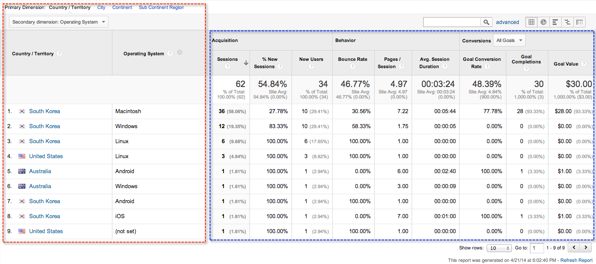
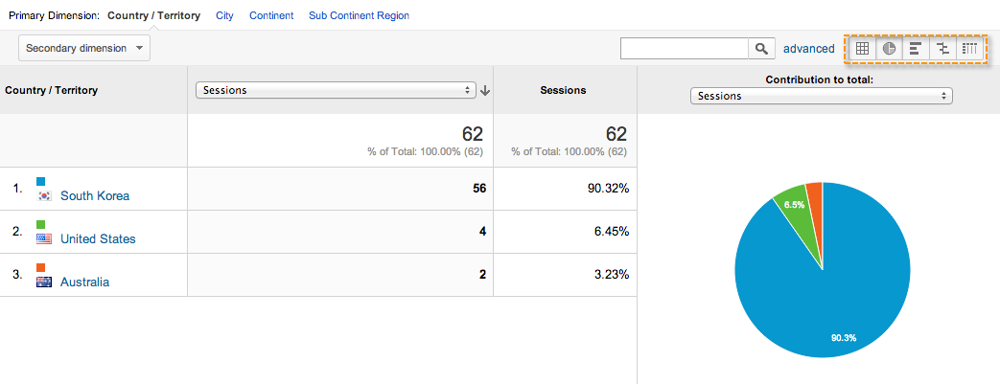
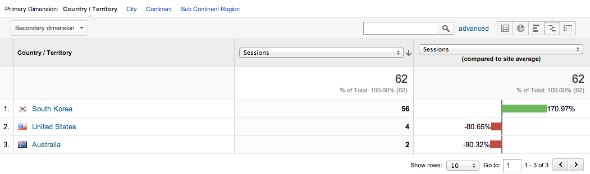

# [fit] **Google Analytics**

## [fit] Advanced Web Metrics with Google Analytics

###### by Daniel Ku (http://kjunine.net)

---

> If you cannot measure it,
> you cannot improve it.
-- Lord Kelvin

---

# Getting Started with Analytics

1. Sign up for an account.
2. Set up account properties.
3. Set up your tracking code.

---


---


---


---


---

# How it works

- Collection
- Processing
- Configuration
- Reporting

---


---

# [fit] Configuration

---


---

# Account Structure

- Accounts
- Properties
- Views


---

# Why multiple views?

# [fit] **Segmentation**

---

# How segment?

# [fit] Filter

---

# Filters

---


---

## Most Commonly Used Filters

- Include **only your website**'s traffic
- Exclude certain **known visitors**
- Segment by **geographical location**
- Segment by **visitor campaign, medium, or referrer source**
- Segment by **content**

---

# Best Practice

# [fit] Keep a **View without Filters**

---

# Filter Demo

---

# Goals

---

# Types of Goal

- **Destination**
- **Duration**
- **Pages/Screens per session**
- **Event**

---

# [fit] Conversion = Goal Conversion

---

# Funnel


---


---

# Goal Demo

---

# User ID

## a **unique** string
## representing a **user**

###### associates data from different devices and multiple sessions

---

# [fit] Collection

---

# Data Model

- User (Visitor)
- Session (Visit)
- Interaction (Hit)


---

# Interaction

- **Pageview**
- **Event**
- Transaction
- Social Interaction
- User Timing
- Exception

---

# Event

- **Category**
- **Action**
- Label (optional)
- Value (optional, integer)

---

# Virtual Pageview

## Virtual Pageview vs. Event ?

---

# Limits and Quotas

## Property Specific

- **10 million hits per month per property**

---

# Limits and Quotas

## Universal Analytics Enabled

- **200,000 hits per user per day**
- **500 hits per session**
  (except item and transaction hit types)

###### This applies to analytics.js, Android/iOS SDK and the Measurement Protocol.

---

# Cookie Usage

By default,

- cookie name: **_ga**
- domain: **top level**
- expiration: **2 years**

---

# Use APIs and SDKs, Later ...

---

# [fit] Reporting

---


---

# Dimension and Metric

---



---

# Table Filter and View Options

---


---



---


---



---


---

# Reporting Demo

---

# [fit] Audience > Overview

# [fit] Audience > Geo > Location

# [fit] Audience > Users Flow

---

# [fit] Acquisition > Overview

# [fit] Acquisition > Channels

# [fit] Acquisition > All Traffic

---

# [fit] Behavior > Overview

# [fit] Behavior > Site Content > All Pages

# [fit] Behavior > Site Speed > Overview

# [fit] Behavior > Events > Overview

---

# [fit] Conversions > Goals > Overview

# [fit] Conversions > Goals > Funnel Visualization

# [fit] Conversions > Goals > Goal Flow

---

# Reporting Demo End

---

# Content Drilldown

---

# [fit] Behavior > Site Content > Content Drilldown

---

# Content Drilldown Demo

---

# Content Experiments

---

# A/B/N Testing

## not A/B Testing
## not Multivariable Test

###### formerly Google Website Optimiser

---

# Behavior > Experiments

---

# Content Experiments Demo

---

# [fit] Development

---

# APIs and SDKs

---


---

# Collection

- analytics.js
- Android SDK
- iOS SDK
- Measurement Protocol
- ...

---

# Configuration

- Management API

---

# Reporting

- Core Reporting API
- MCF API
- Metadata API
- Real Time Reporting API

---

# [fit] Development with analytics.js

---

```html
<!-- Google Analytics -->
<script>
(function(i,s,o,g,r,a,m){i['GoogleAnalyticsObject']=r;i[r]=i[r]||function(){
(i[r].q=i[r].q||[]).push(arguments)},i[r].l=1*new Date();a=s.createElement(o),
m=s.getElementsByTagName(o)[0];a.async=1;a.src=g;m.parentNode.insertBefore(a,m)
})(window,document,'script','//www.google-analytics.com/analytics.js','ga');

ga('create', 'UA-XXXX-Y', 'auto');
ga('send', 'pageview');
</script>
<!-- End Google Analytics -->
```

---

# Pageview Tracking

```javascript
ga('send', 'pageview');
```

---

# Virtual Pageview

```javascript
ga('send', 'pageview', '/path/to/virtual/page');
```

```javascript
ga('send', {
  'hitType': 'pageview',
  'page': '/path/to/virtual/page',
  'title': 'Title of Virtual Page'
})
```

---

# Event Tracking

```javascript
ga('send', 'event', 'button', 'click', 'nav buttons', 4);
```

```javascript
ga('send', {
  'hitType': 'event',          // Required.
  'eventCategory': 'button',   // Required.
  'eventAction': 'click',      // Required.
  'eventLabel': 'nav buttons',
  'eventValue': 4
});
```

---

# User ID

```javascript
ga('create', 'UA-XXXX-Y', { 'userId': 'USER_ID' });
```

```javascript
ga('set', '&uid', 'USER_ID');
```

---

# Google Analytics Libraries for **MEAN** Stack

---

# **Angulartics**

## [fit] Web analytics for **AngularJS** applications

- http://luisfarzati.github.io/angulartics/

```javascript
angular.module('myApp', ['angulartics', 'angulartics.google.analytics'])
```


- supports Google Analytics, Kissmetrics, Mixpanel, Chartbeat and Segment.io

---

# **universal-analytics**

## [fit] A **node** module for Google's Universal Analytics tracking

- https://github.com/peaksandpies/universal-analytics

```javascript
var ua = require('universal-analytics');
var visitor = ua('UA-XXXX-XX', 'USER_ID');
visitor.pageview("/").send();
```

---

# References

http://www.acornpub.co.kr/book/google-analytics2

https://analyticsacademy.withgoogle.com/
https://support.google.com/analytics/
https://developers.google.com/analytics/

http://luisfarzati.github.io/angulartics/
https://github.com/peaksandpies/universal-analytics

---

# [fit] Thank you!
